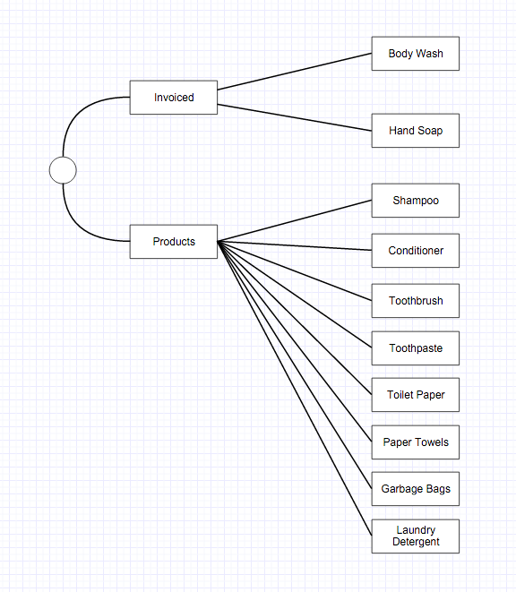

### Invoiced is an invoicing application built using React, Node, Socket.io and Redux ###

### Getting Started ###

```
> git clone https://github.com/invoice-creator/invoiced
> cd invoiced
> npm install

```

### Server Operation Process ###

```
1. A client sends an action to the server
2. The server hands the action to the Redux Store
3. The Store calls the reducer and the reducer executes the logic related to the action
4. The Store updates its state based on the return value of the reducer
5. The Store executes the listener function subscribed by the server
6. The server emits a 'state' event
7. All connected clients - including the one that initiated the original action - receive the new state

```

### Server Commands ###

To run server:

```
> cd server
> npm run start

```

To run server side tests:

```
> cd server
> npm run test

```

To watch for changes in server side tests:

```
> cd server 
> npm run test:watch

```

### Client Commands ###

To run client side tests:

```
> cd client
> npm run test

```

To watch for changes in client side tests:

```
> cd client 
> npm run test:watch

```

### Application immutable state tree: ###


### Immutable State Tree for product line items: ###


### When product line items are added to an invoice the state should reflect the changes and the items should no longer be listed in the products section, but instead on the actual invoice: ###




