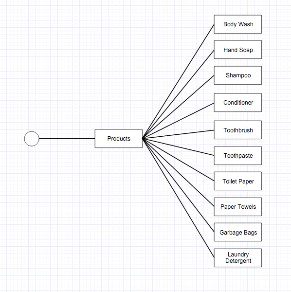

### Invoiced is an invoicing application built using React, Node, Socket.io and Redux ###

### Getting Started ###

```
> git clone https://github.com/invoice-creator/invoiced
> cd invoiced
> npm install

```

### Server Operation Process ###

```
1. A client sends an action to the server
2. The server hands the action to the Redux Store
3. The Store calls the reducer and the reducer executes the logic related to the action
4. The Store updates its state based on the return value of the reducer
5. The Store executes the listener function subscribed by the server
6. The server emits a 'state' event
7. All connected clients - including the one that initiated the original action - receive the new state

```

### Client Components and Separation of State ###

```
When React components are combined with Redux and Immutable all components become so-called Pure Components (also sometimes called "Dumb Components"). As a concept, this is similar to pure functions, in that there are a couple of rules to follow:

1. A pure component receives all its data as props, like a function receives all its data as arguments. It should have no side effects, including reading data from anywhere else, initiating network requests, etc.

2. A pure component generally has no internal state. What it renders is fully driven by its input props. Rendering the same pure component twice with the same props should result in the same UI. There's no hidden state inside the component that would cause the UI to differ between the two renders.
This has a similar simplifying effect as using pure functions does: We can figure out what a component does by looking at what it receives as inputs and what it renders. There's nothing else we need to know about the component. It can also be tested rather easily.

3. The state lives in an immutable data structure inside of a Redux store. Redux allows us the ability to separate the state from the UI code. React components become a stateless projection of the state at a given point in time.

```

### Server Commands ###

To run server:

```
> cd server
> npm run start

```

To run server side tests:

```
> cd server
> npm run test

```

To watch for changes in server side tests:

```
> cd server 
> npm run test:watch

```

### Client Commands ###

To run client side tests:

```
> cd client
> npm run test

```

To watch for changes in client side tests:

```
> cd client 
> npm run test:watch

```

### Application immutable state tree: ###


### Immutable State Tree for product line items: ###



### When product line items are added to an invoice the state should reflect the changes and the items should no longer be listed in the products section, but instead on the actual invoice: ###


